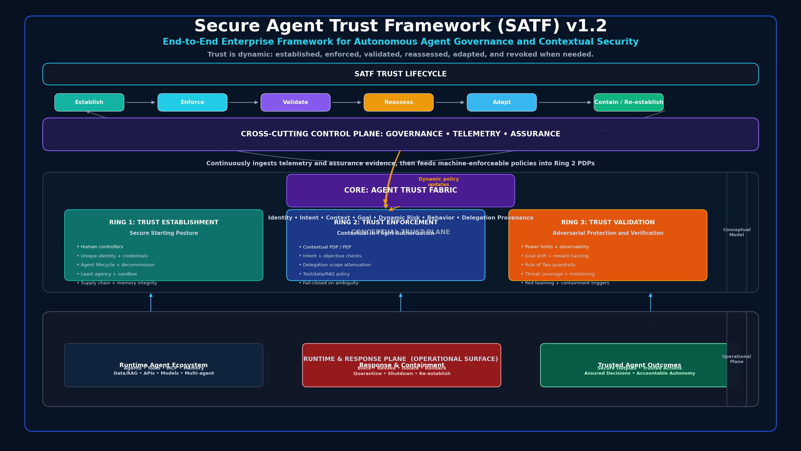
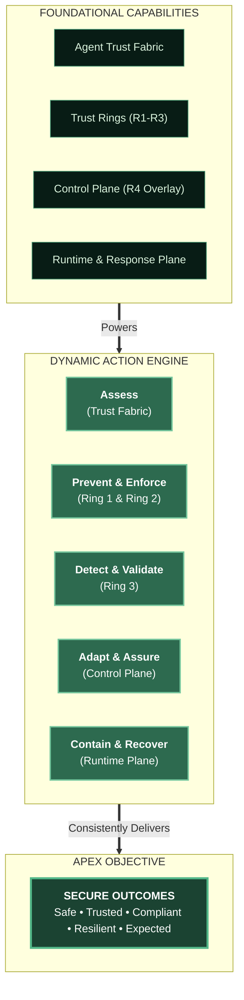
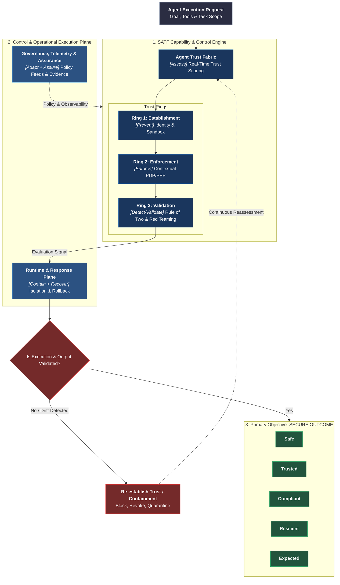
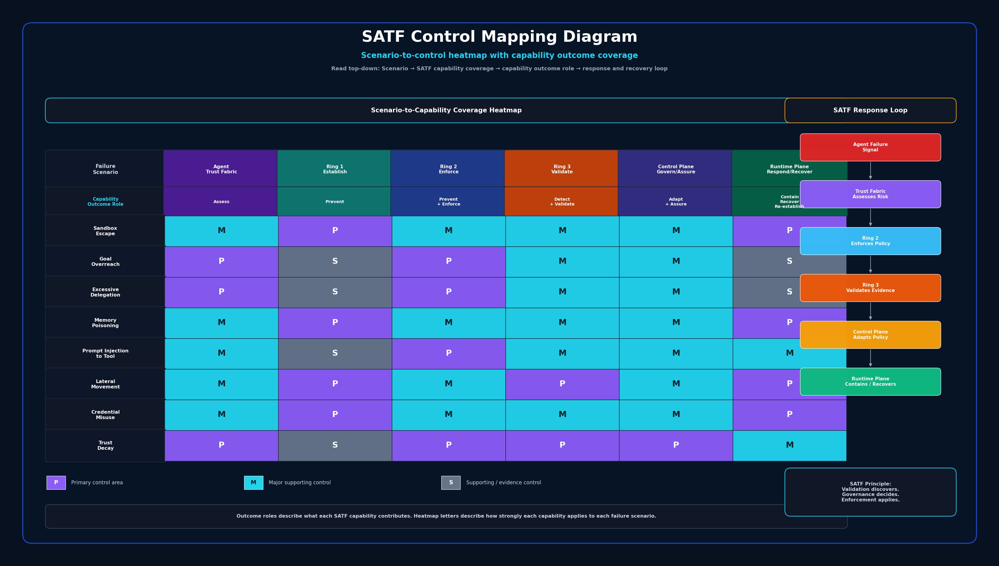

# Secure Agent Trust Framework (SATF) Baseline 1.0
### Safe, Trusted, Compliant, Resilient, and Expected Outcomes

**End-to-End Enterprise Framework for Autonomous Agent Governance and Contextual Security**

SATF is a vendor-neutral framework for establishing, enforcing, validating, reassessing, adapting, and revoking trust in autonomous agent systems.

## Core idea

Trust is not granted once. Trust is dynamic. Trust is established, consumed, validated, reassessed, adapted, and revoked or re-established when needed.

# Why SATF Exists

Traditional security frameworks focus on securing identities, access, resources, networks, and applications.

Autonomous agents introduce a different challenge.

The fundamental objective is no longer simply protecting access.

The objective is ensuring that autonomous agents consistently produce secure outcomes.

SATF helps organizations achieve:

- Safe Outcomes
- Trusted Outcomes
- Compliant Outcomes
- Resilient Outcomes
- Expected Outcomes

---

## What Is a Secure Outcome?

A secure outcome is:

- The right action
- Performed by the right agent
- For the right objective
- Using the right authority
- Within approved boundaries
- With continuous validation
- With recoverable trust

SATF continuously evaluates trust throughout the agent lifecycle to ensure that task completion never overrides secure outcomes.

---

# SATF Outcome Model

SATF capabilities exist to achieve secure outcomes.

| SATF Capability | Primary Outcome Role |
|-----------------|----------------------|
| Agent Trust Fabric | Assess |
| Ring 1: Trust Establishment | Prevent |
| Ring 2: Trust Enforcement | Prevent + Enforce |
| Ring 3: Trust Validation | Detect + Validate |
| Governance, Telemetry & Assurance Control Plane | Adapt + Assure |
| Runtime & Response Plane | Contain + Recover + Re-establish |

---

## SATF Core Principle

The controls are not the goal.

**Secure outcomes are the goal.**

> SATF exists to ensure autonomous agents consistently produce safe, trusted, compliant, resilient, and expected outcomes, even when objectives evolve, context changes, authority is delegated, tools expand, threats emerge, and trust must be continuously reassessed.

  
<b>Core Principle Pyramid (Objective over Control)</b> 

  
<b>Comprehensive SATF Outcome Engine Flow</b> 

---

## Control Mapping Matrix

The Secure Agent Trust Framework (SATF) Control Mapping Matrix helps security architects, product security teams, platform engineers, governance teams, and auditors understand how SATF capabilities work together to prevent, detect, validate, contain, recover from, and ultimately re-establish trust following agent failures.

Rather than asking:

> Which security control should I deploy?

SATF asks:

> Which framework capabilities should work together to ensure secure outcomes when autonomous agents encounter risk, uncertainty, or compromise?

- [How to read this diagram](docs/11-satf-in-action/SATF-Control-Mapping-Matrix/satf-control-mapping-matrix-introduction.md)

---
## Framework structure

SATF Baseline 1.0 uses three coordinated views:

1. **Conceptual Trust Plane**
   - Core: Agent Trust Fabric
   - Ring 1: Trust Establishment
   - Ring 2: Trust Enforcement
   - Ring 3: Trust Validation

2. **Cross-Cutting Control Plane**
   - Governance
   - Telemetry
   - Assurance

3. **Runtime and Response Plane**
   - Runtime Agent Ecosystem
   - Response and Containment
   - Trusted Agent Outcomes

## Quick navigation

- [Why SATF](docs/00-overview/why-satf.md)
- [Trust Lifecycle](docs/00-overview/trust-lifecycle.md)
- [Framework Structure](docs/00-overview/framework-structure.md)
- [Agent Trust Fabric](docs/01-agent-trust-fabric/README.md)
- [Trust Establishment](docs/02-ring-1-trust-establishment/README.md)
- [Trust Enforcement](docs/03-ring-2-trust-enforcement/README.md)
- [Trust Validation](docs/04-ring-3-trust-validation/README.md)
- [Governance, Telemetry, and Assurance](docs/05-cross-cutting-control-plane/README.md)
- [Runtime and Response Plane](docs/06-runtime-response-plane/README.md)
- [Maturity Model](docs/07-maturity-model/README.md)
- [Alignment Mapping](docs/08-alignment-mapping/README.md)
- [Control Catalog](docs/09-control-catalog/README.md)
- [SATF In Action](docs/11-satf-in-action/README.md)
- [FAQ](docs/12-faq/README.md)
- [Pattern Library](docs/12-pattern-library/README.md)
- [Tech Reference](docs/13-technical-reference/README.md)
- [Appendices](docs/10-appendices/README.md)

## Baseline 1.0 status

This repository represents the public/community baseline version of SATF. Internal working versions have been normalized into **Baseline 1.0** for clarity.
