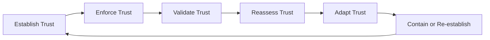

# SATF Trust Lifecycle

Trust is not a one-time grant. Trust is dynamic.



## Lifecycle steps

1. **Establish Trust** through ownership, identity, credentials, lifecycle state, least agency, sandboxing, and supply chain posture.
2. **Enforce Trust** through contextual authorization, objective checks, delegation constraints, PDP/PEP controls, and fail-closed decisions.
3. **Validate Trust** through observability, testing, threat coverage, Rule of Two guardrails, goal integrity, and adversarial exercises.
4. **Reassess Trust** using telemetry, risk signals, audit findings, behavioral drift, goal drift, and assurance evidence.
5. **Adapt Trust** by tightening or relaxing policy, reducing scopes, requiring step-up review, or suspending delegation.
6. **Contain or Re-establish Trust** through block, revoke, isolate, rollback, quarantine, shutdown, revalidation, and controlled re-entry.

## Trust decay

Trust decays when evidence increases uncertainty or risk.

Common triggers:

- Anomalous behavior
- Excessive delegation
- Unsafe tool usage
- Goal drift
- Policy violations
- Failed assurance checks
- Privilege escalation attempts
- Memory contamination
- Supply chain alerts

As trust decays, enforcement should move from:

```text
Allow → Constrain → Step-up Review → Monitor → Contain → Revoke
```
