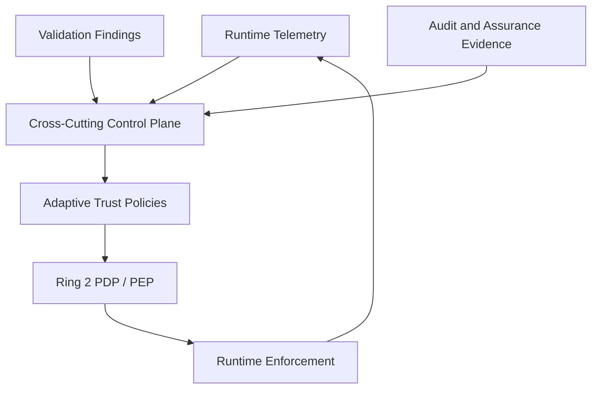

# Continuous Trust Reassessment Loop

```mermaid
flowchart TD
    A[Runtime Telemetry] --> B[Cross-Cutting Control Plane]
    C[Validation Findings] --> B
    D[Audit and Assurance Evidence] --> B
    B --> E[Adaptive Trust Policies]
    E --> F[Ring 2 PDP / PEP]
    F --> G[Runtime Enforcement]
    G --> A
```

## Principle

Validation discovers. Governance decides. Enforcement applies.
