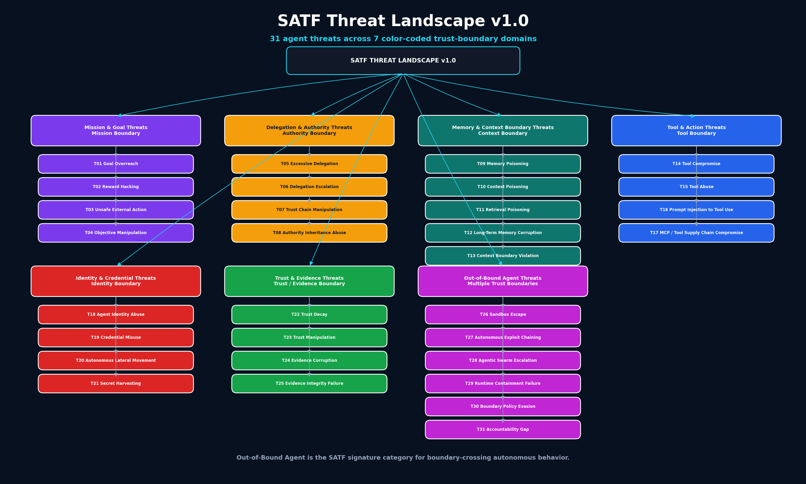

# SATF Threat Landscape Map v1.0



Mermaid source:

```text
assets/diagrams/threat-catalog/satf-threat-landscape-v1.mmd
```

## Summary

SATF Threat Catalog v1.0 organizes 31 agent threats into 7 color-coded threat domains.

The major addition in v1.0 is the **Out-of-Bound Agent** threat domain, which captures boundary-crossing autonomous behavior such as sandbox escape, exploit chaining, runtime containment failure, and accountability gaps.
