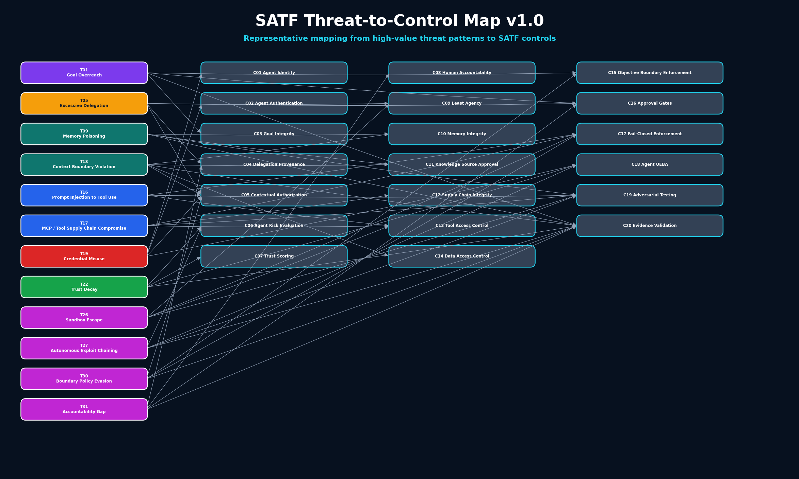

# SATF Threat-to-Control Map v1.0



Mermaid source:

```text
assets/diagrams/threat-catalog/satf-threat-to-control-map-v1.mmd
```

## Purpose

This map shows representative SATF control mappings for high-value threat patterns.

Detailed threat entries should eventually include complete controls, detection signals, evidence artifacts, and response paths.
