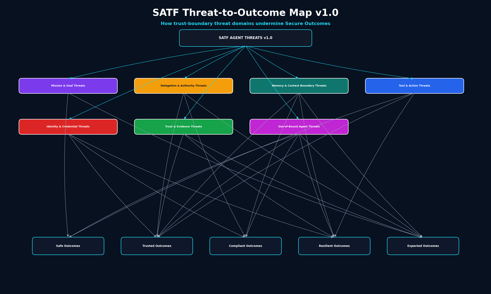

# SATF Threat-to-Outcome Map v1.0



Mermaid source:

```text
assets/diagrams/threat-catalog/satf-threat-to-outcome-map-v1.mmd
```

## Purpose

This map connects each threat domain to the Secure Outcomes that may be undermined.

The Out-of-Bound Agent domain can impact all five SATF secure outcomes:

- Safe Outcomes
- Trusted Outcomes
- Compliant Outcomes
- Resilient Outcomes
- Expected Outcomes
