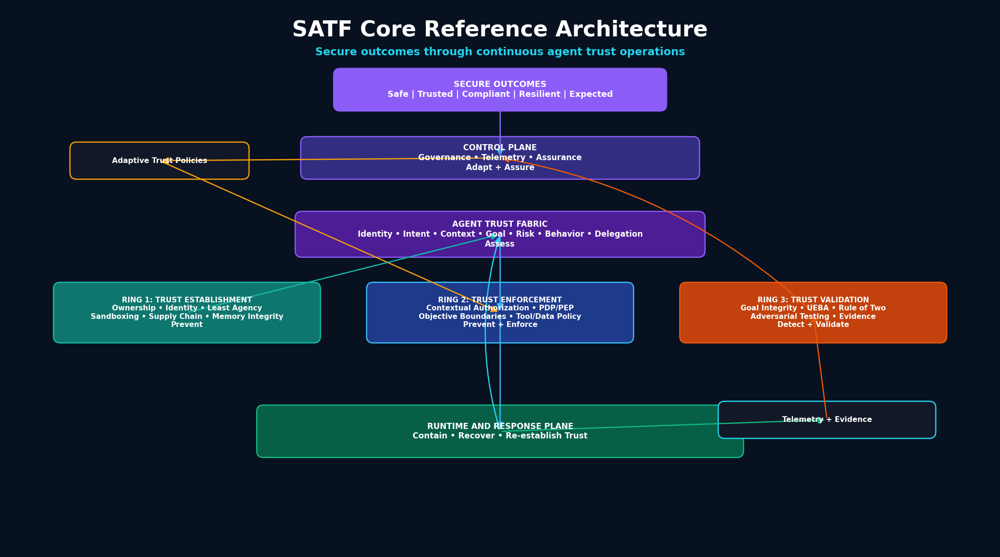

# RA-00: Core SATF Reference Architecture

## Purpose

The Core SATF Reference Architecture is the canonical architecture for the Secure Agent Trust Framework. It shows the core SATF capabilities independent of a specific use case.

All use-case-specific reference architectures should inherit from this core model.

## Diagram



Mermaid source:

```text
assets/diagrams/reference-architectures/00-core-reference-architecture.mmd
```

## Architecture overview

The Core SATF Reference Architecture connects six major capability areas:

1. Secure Outcomes
2. Agent Trust Fabric
3. Ring 1: Trust Establishment
4. Ring 2: Trust Enforcement
5. Ring 3: Trust Validation
6. Governance, Telemetry, and Assurance Control Plane
7. Runtime and Response Plane

## SATF Outcome Model

| SATF Capability | Outcome Role |
|---|---|
| Agent Trust Fabric | Assess |
| Ring 1: Trust Establishment | Prevent |
| Ring 2: Trust Enforcement | Prevent + Enforce |
| Ring 3: Trust Validation | Detect + Validate |
| Governance, Telemetry and Assurance Control Plane | Adapt + Assure |
| Runtime and Response Plane | Contain + Recover + Re-establish |

## Trust flow

```text
Establish trust -> Assess trust -> Enforce trust -> Validate trust -> Adapt policy -> Contain / Recover / Re-establish trust
```

## Key design principles

- Secure outcomes are the goal.
- Trust is not granted once.
- Goal approval does not mean every action is approved.
- Delegated trust is not inherited trust.
- Validation discovers, governance decides, enforcement applies.

## Failure scenarios covered

- Sandbox escape
- Goal overreach
- Excessive delegation
- Memory poisoning
- Prompt injection to tool use
- Lateral movement
- Credential misuse
- Trust decay

## Evidence artifacts

- Agent inventory record
- Credential issuance logs
- PDP / PEP decision logs
- Tool invocation logs
- Delegation chain records
- Goal validation records
- Runtime telemetry
- Validation findings
- Adaptive policy updates
- Containment and re-establishment records
