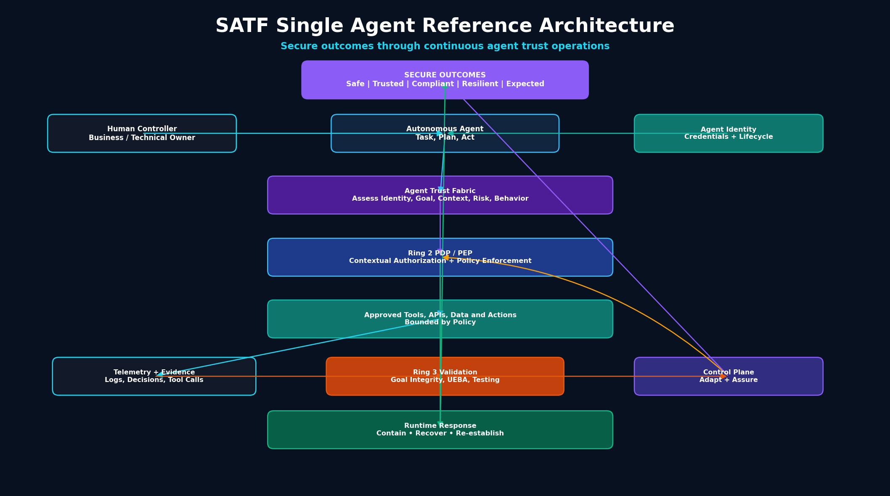

# RA-01: Single Agent Reference Architecture

## Purpose

The Single Agent Reference Architecture represents the smallest deployable SATF implementation. It is intended for one autonomous agent operating with bounded tools, data, APIs, identity, telemetry, validation, and runtime response.

This architecture extends the SATF Core Reference Architecture.

## Diagram



Mermaid source:

```text
assets/diagrams/reference-architectures/01-single-agent-reference-architecture.mmd
```

## Architecture context

A single agent receives a task from a human controller or approved workflow, evaluates trust through the Agent Trust Fabric, requests authorization through Ring 2 enforcement, performs approved actions through tools, APIs, or data access, and emits telemetry for validation and governance.

## Core components

- Human Controller / Business Owner
- Autonomous Agent
- Agent Identity and Credentials
- Agent Trust Fabric
- Ring 2 PDP / PEP
- Approved Tools / APIs / Data
- Telemetry and Evidence
- Ring 3 Validation
- Governance, Telemetry and Assurance Control Plane
- Runtime Response
- Secure Outcomes

## Trust boundaries

Key trust boundaries include:

- Human-to-agent task boundary
- Agent identity boundary
- Agent-to-tool boundary
- Data access boundary
- Policy decision boundary
- Runtime containment boundary

## Control mapping

| SATF Area | Implementation Role |
|---|---|
| Agent Trust Fabric | Assesses identity, intent, context, goal, behavior, risk, and delegation |
| Ring 1 | Establishes identity, ownership, least agency, sandboxing, and lifecycle controls |
| Ring 2 | Enforces contextual authorization for actions, tools, and data access |
| Ring 3 | Validates goal integrity, behavior, and evidence |
| Control Plane | Adapts policy using telemetry and validation evidence |
| Runtime Plane | Contains, recovers, and re-establishes trust |

## Failure scenarios covered

- Goal overreach
- Prompt injection to tool use
- Unsafe external action
- Credential misuse
- Trust decay

## Secure outcomes supported

- Safe Outcomes
- Trusted Outcomes
- Compliant Outcomes
- Resilient Outcomes
- Expected Outcomes

## Evidence artifacts

- Agent identity and ownership record
- Tool authorization policies
- PDP decision logs
- Tool invocation logs
- Goal evaluation records
- Validation findings
- Containment / recovery records
