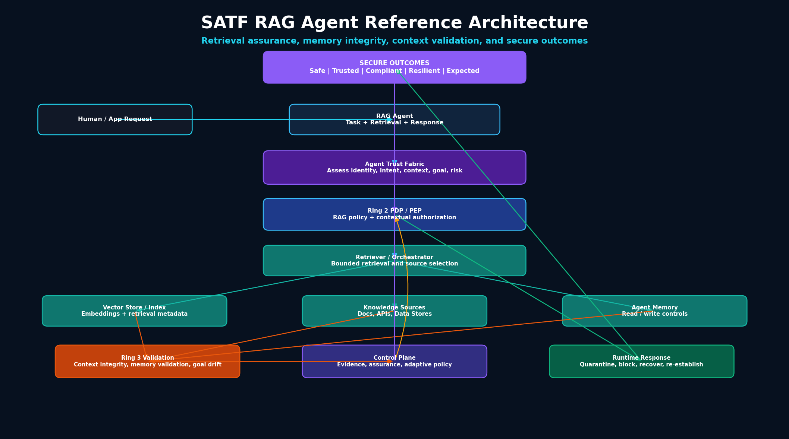

# RA-02: RAG Agent Reference Architecture

## Purpose

The RAG Agent Reference Architecture extends the SATF Core Reference Architecture with retrieval, knowledge, memory, and context-specific controls.

This architecture is designed for agents that retrieve enterprise knowledge, use vector indexes, access documents or APIs, maintain memory, and generate outputs based on retrieved context.

## Diagram



Mermaid source:

```text
assets/diagrams/reference-architectures/02-rag-agent-reference-architecture.mmd
```

## Architecture context

RAG agents introduce trust risks that do not exist in simple tool-only systems. Retrieved context can be stale, poisoned, incomplete, unauthorized, or misaligned with the approved task. Memory can also persist unsafe or misleading context across missions.

SATF treats retrieval and memory as trust surfaces.

## Core components

- Human / Application Request
- RAG Agent
- Agent Trust Fabric
- Ring 2 PDP / PEP
- Retriever / Orchestrator
- Vector Store / Index
- Knowledge Sources
- Agent Memory
- Ring 3 Validation
- Governance, Telemetry, and Assurance Control Plane
- Runtime Response
- Secure Outcomes

## Key SATF controls

### Ring 1: Trust Establishment

- Approved knowledge sources
- Memory integrity controls
- Retrieval source registration
- Vector store governance
- Least agency for data and tool access

### Ring 2: Trust Enforcement

- RAG policy enforcement
- Contextual authorization
- Source-level data policy
- Memory write controls
- Retrieval constraints
- Step-up review for sensitive retrieval or external action

### Ring 3: Trust Validation

- Context integrity validation
- Memory poisoning detection
- Goal integrity checks
- Retrieval freshness assessment
- Adversarial prompt-to-retrieval testing

### Control Plane

- Evidence freshness policies
- Retrieval source governance
- Adaptive trust policies
- Assurance evidence

### Runtime Plane

- Quarantine memory
- Block retrieval source
- Recover from poisoned context
- Re-establish trust after validation

## Failure scenarios covered

- Memory poisoning
- Prompt injection to tool use
- Retrieval poisoning
- Goal overreach
- Unsafe external action
- Trust decay

## Secure outcomes supported

- Safe Outcomes
- Trusted Outcomes
- Compliant Outcomes
- Resilient Outcomes
- Expected Outcomes

## Evidence artifacts

- Retrieval trace
- Source authorization record
- Vector index update record
- Memory read/write log
- PDP decision log
- Goal validation record
- Context integrity finding
- Memory quarantine record
