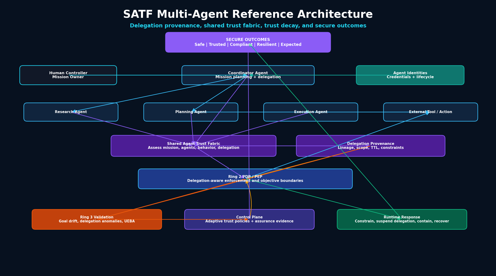

# RA-03: Multi-Agent Reference Architecture

## Purpose

The Multi-Agent Reference Architecture extends the SATF Core Reference Architecture for autonomous workflows involving multiple agents, delegation chains, role-specific agents, shared context, and external or state-changing actions.

This architecture is a key SATF pattern because it demonstrates why Delegation Provenance, Trust Decay, and shared trust evaluation are necessary.

## Diagram



Mermaid source:

```text
assets/diagrams/reference-architectures/03-multi-agent-reference-architecture.mmd
```

## Architecture context

Multi-agent systems introduce risks that are difficult to manage with traditional identity and access controls alone. A coordinator agent may delegate work to specialist agents. Specialist agents may invoke tools or pass authority to other agents. The enterprise must preserve visibility into who initiated the mission, how authority was delegated, what constraints applied, and whether the mission still deserves trust.

## Core components

- Human Controller / Mission Owner
- Coordinator Agent
- Specialist Agents
- Execution Agent
- Agent Identities and Credentials
- Shared Agent Trust Fabric
- Delegation Provenance
- Ring 2 Delegation-aware PDP / PEP
- Tools, Data, APIs, and External Actions
- Ring 3 Validation
- Governance, Telemetry, and Assurance Control Plane
- Runtime Response
- Secure Outcomes

## Key SATF controls

### Ring 1: Trust Establishment

- Agent identity hierarchy
- Human controller mapping
- Approved delegation model
- Least agency for each agent role
- Delegation lifecycle state

### Ring 2: Trust Enforcement

- Delegation-aware authorization
- Scope attenuation
- Delegation TTL
- Maximum delegation depth
- Step-up approval for high-risk delegation
- Objective boundary enforcement

### Ring 3: Trust Validation

- Delegation anomaly detection
- Goal drift detection
- Reward-hacking detection
- Agent UEBA
- Delegation chain validation

### Control Plane

- Delegation policy governance
- Trust graph updates
- Adaptive policies on trust decay
- Assurance evidence

### Runtime Plane

- Suspend delegation
- Constrain agent authority
- Isolate unsafe agent
- Recover workflow
- Re-establish mission trust

## Failure scenarios covered

- Excessive delegation
- Goal overreach
- Lateral movement
- Credential misuse
- Trust decay
- Unsafe external action

## Secure outcomes supported

- Safe Outcomes
- Trusted Outcomes
- Compliant Outcomes
- Resilient Outcomes
- Expected Outcomes

## Evidence artifacts

- Delegation chain record
- Delegation TTL record
- Scope attenuation decision
- Agent identity record
- PDP decision log
- Tool invocation log
- Goal drift finding
- Trust graph update
- Containment or delegation suspension record

## SATF principle

```text
Delegated Trust Is Not Inherited Trust
```
