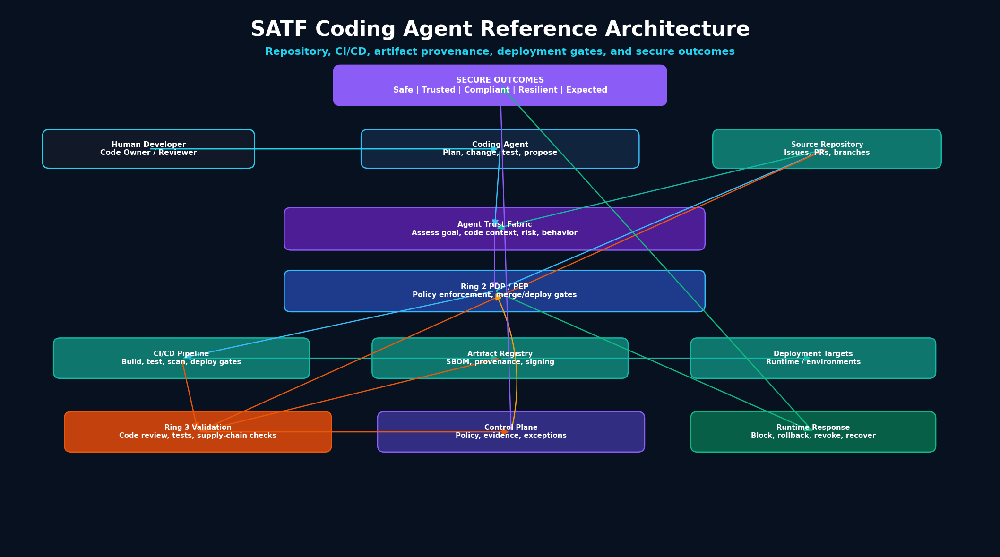

# RA-04: Coding Agent Reference Architecture

## Purpose

The Coding Agent Reference Architecture extends the SATF Core Reference Architecture for autonomous or semi-autonomous agents that modify code, create pull requests, write tests, interact with CI/CD systems, generate artifacts, or influence deployments.

## Diagram



Mermaid source:

```text
assets/diagrams/reference-architectures/04-coding-agent-reference-architecture.mmd
```

## Architecture context

Coding agents create unique risks because they can convert generated intent into executable changes. A coding agent may introduce unsafe code, bypass tests, overreach the requested task, expose secrets, or influence software supply chain artifacts.

SATF treats the coding workflow as an autonomous mission that must remain bounded by identity, goal, code context, policy, validation evidence, and recoverable trust.

## Core components

- Human Developer / Code Owner
- Coding Agent
- Source Repository
- Agent Trust Fabric
- Ring 2 PDP / PEP
- CI/CD Pipeline
- Artifact Registry / SBOM / Provenance
- Deployment Targets
- Ring 3 Validation
- Governance, Telemetry, and Assurance Control Plane
- Runtime Response
- Secure Outcomes

## Key SATF controls

### Ring 1: Trust Establishment

- Agent identity and repository-scoped credentials
- Human code owner and reviewer assignment
- Least agency for repository, branch, CI/CD, and deployment access
- Approved tools and build systems
- Software supply chain provenance requirements

### Ring 2: Trust Enforcement

- Repository policy enforcement
- Branch protection and pull request gates
- Contextual authorization for code, CI/CD, artifact, and deployment actions
- Step-up approval for production-impacting changes
- Objective boundary enforcement for requested coding tasks

### Ring 3: Trust Validation

- Code review evidence
- Test and scan results
- SBOM and artifact provenance validation
- Goal integrity validation
- Prompt-to-code injection testing
- Supply chain integrity checks

### Control Plane

- Policy updates based on validation evidence
- Exception management
- Audit and assurance reporting
- Secure development evidence review

### Runtime Plane

- Block merge
- Disable agent access
- Roll back deployment
- Revoke credentials
- Re-establish trust after remediation

## Failure scenarios covered

- Goal overreach
- Prompt injection to tool use
- Credential misuse
- Unsafe external action
- Software supply chain compromise
- Trust decay

## Secure outcomes supported

- Safe Outcomes
- Trusted Outcomes
- Compliant Outcomes
- Resilient Outcomes
- Expected Outcomes

## Evidence artifacts

- Agent identity record
- Repository authorization record
- Pull request and code review record
- CI/CD logs
- Test and scan results
- SBOM / provenance record
- PDP / PEP decision log
- Deployment approval record
- Rollback or containment record
