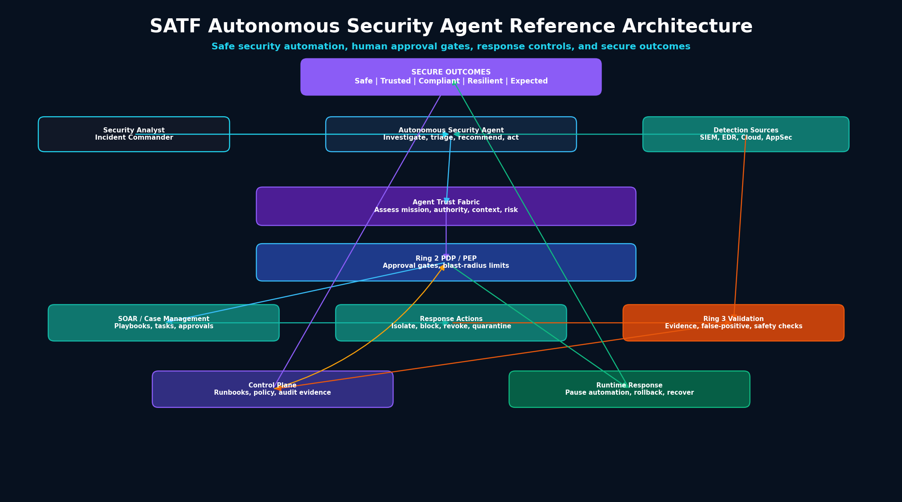

# RA-05: Autonomous Security Agent Reference Architecture

## Purpose

The Autonomous Security Agent Reference Architecture extends the SATF Core Reference Architecture for security agents that investigate alerts, triage incidents, enrich evidence, recommend actions, or execute bounded response actions.

## Diagram



Mermaid source:

```text
assets/diagrams/reference-architectures/05-autonomous-security-agent-reference-architecture.mmd
```

## Architecture context

Autonomous security agents can improve response speed, but they also carry high risk. An incorrect action may isolate critical systems, block legitimate users, revoke valid credentials, or trigger unnecessary escalation.

SATF ensures security automation remains bounded, evidence-driven, reversible where possible, and subject to human oversight for high-impact actions.

## Core components

- Security Analyst / Incident Commander
- Autonomous Security Agent
- Detection Sources
- Agent Trust Fabric
- Ring 2 PDP / PEP
- SOAR / Case Management
- Response Actions
- Ring 3 Validation
- Governance, Telemetry, and Assurance Control Plane
- Runtime Response
- Secure Outcomes

## Key SATF controls

### Ring 1: Trust Establishment

- Agent identity and scoped security permissions
- Human controller and incident ownership
- Approved playbooks and response actions
- Least agency for security tools
- Response action risk classification

### Ring 2: Trust Enforcement

- Action policy enforcement
- Human approval gates for high-impact response
- Blast-radius limits
- Contextual authorization for response actions
- Step-up review when evidence confidence is low

### Ring 3: Trust Validation

- Evidence validation
- False-positive checks
- Safety constraints
- Agent UEBA
- Runbook validation
- Post-action outcome validation

### Control Plane

- Detection policy feedback
- SOAR playbook governance
- Audit evidence
- Exception management
- Adaptive trust policies

### Runtime Plane

- Pause automation
- Roll back response action where possible
- Revoke agent authority
- Recover affected services
- Re-establish trust after incident review

## Failure scenarios covered

- Unsafe external action
- Goal overreach
- Credential misuse
- Trust decay
- Excessive delegation
- False-positive driven response

## Secure outcomes supported

- Safe Outcomes
- Trusted Outcomes
- Compliant Outcomes
- Resilient Outcomes
- Expected Outcomes

## Evidence artifacts

- Alert and evidence record
- Agent identity and permission record
- PDP / PEP decision log
- Playbook execution log
- Human approval record
- Response action record
- Validation finding
- Rollback or recovery record
- Post-incident trust decision record
