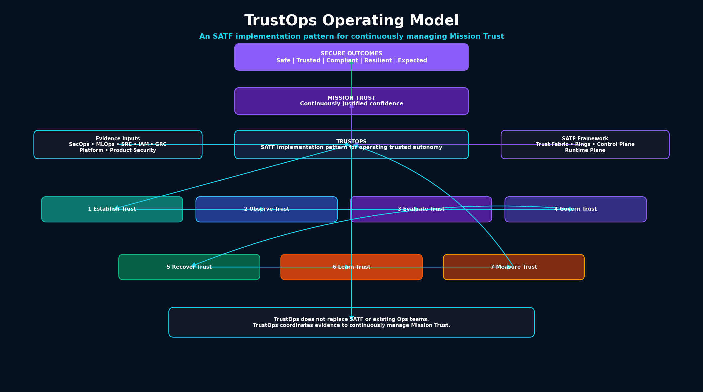

# TrustOps: Operating Trusted Autonomy

TrustOps is an SATF implementation pattern for operating trusted autonomy.

It is not a replacement for SATF, the Agent Trust Fabric, the trust rings, or the Governance, Telemetry, and Assurance Control Plane. TrustOps describes how organizations can operationalize SATF in production to continuously manage Mission Trust and achieve Secure Outcomes.

## Files

- `trustops-operating-model.md`
- `mission-trust.md`
- `trustops-functions.md`
- `trustops-metrics.md`
- `trust-decision-records.md`

## Diagram

